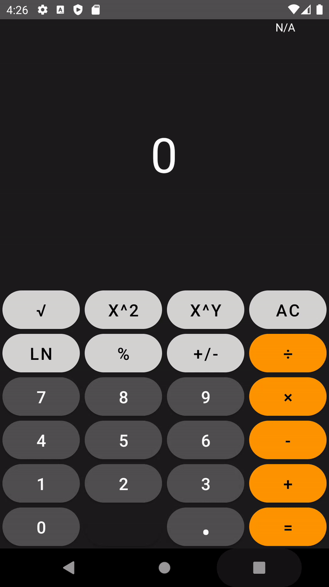
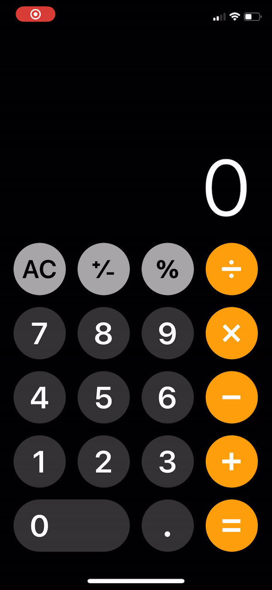

# Android Calculator App

An Android calculator app that accurately mimics the iPhone calculator app.

(The code files are in /app/src/main/java/com/example/mycalculator/)

 

  
  

# How to Install

Download the apk from releases and install it on an android by opening the file and using the android's package installer.

Can also use Android Studio to open the project folder and simulate using an Android Emulator.

# How to Use

Use like how you would use a normal calculator.

Includes order of operations, so clicking a new operating changes the display number based on PEMDAS.
